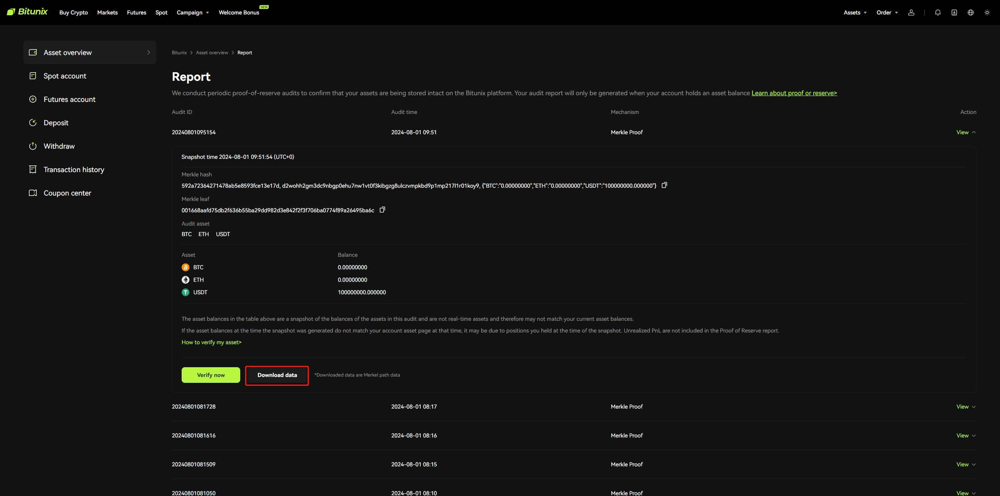

# Proof of Reserves Licensed to Bitunix Limited

## Verification Steps
1. Take the executable  verifier that you need to download on the Bitunix platform for your operating system and architecture.
- proof-of-reserves-linux-amd64-v1.0.0.zip
- proof-of-reserves-linux-arm64-v1.0.0.zip
- proof-of-reserves-macos-v1.0.0.zip
- proof-of-reserves-windows-v1.0.0.zip
2. Unzip the file to a specified directory, for example:
   `~/Downloads/proof-of-reserves-*`
3. Download the file from our official website and substitute the file with the same name under your directory`~/Downloads/proof-of-reserves-*`
   
4. Run start file `sh start.sh` or double-click the `start.bat` file
5. View results  
   1）If your data are correct and the verification passed, then the result is "Consistent with the Merkle tree root hash. The verification succeeds".  
   2）If your data are wrong and the verification fails, the result is "Inconsistent with the Merkle tree root hash. The verification fails".